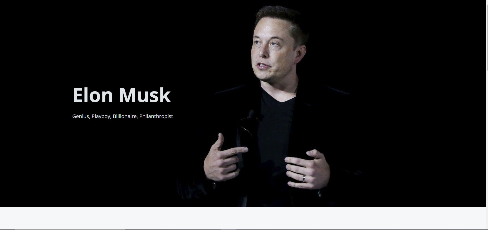

# Tribute Page

This is one of my https://www.freecodecamp.org/learn/responsive-web-design/responsive-web-design-projects/build-a-tribute-page projects. Enjoy!
## [Elon Musk](https://eryscode7.github.io/elon-musk-tribute-page/)

## Table of contents

- [Overview](#overview)
  - [Screenshot](#screenshot)
  - [Links](#links)
- [My process](#my-process)
  - [Built with](#built-with)
- [Author](#author)

## Overview

### Screenshot

### Links

- Solution URL: [https://github.com/ErysCode7/elon-musk-tribute-page](https://github.com/ErysCode7/elon-musk-tribute-page)
- Live Site URL: [https://eryscode7.github.io/elon-musk-tribute-page/](https://https://eryscode7.github.io/elon-musk-tribute-page/)

## My process

### Built with

- Semantic HTML5 markup
- CSS custom properties
- Flexbox
- CSS Grid
- Desktop-first workflow
- SASS

## Author

- Facebook - [Erys Mozo](https://web.facebook.com/erys.mozo/)
- Instagram - [_erysmozo](https://www.instagram.com/_erysmozo/)
- Frontend Mentor - [ErysCode7](https://www.frontendmentor.io/profile/ErysCode7)
- LinkedIn - [Erys Mozo](https://www.linkedin.com/in/erys-mozo-280190230/)
